# SDK 뼈대 만들어보기

**GitHub**

https://github.com/kiryun/TestSDK

## 개발환경 세팅

SDK 뼈대를 만들기 전에 개발환경을 먼저 세팅하도록 하겠습니다.

우리가 만들 SDK의 뼈대는 다음과 같습니다.

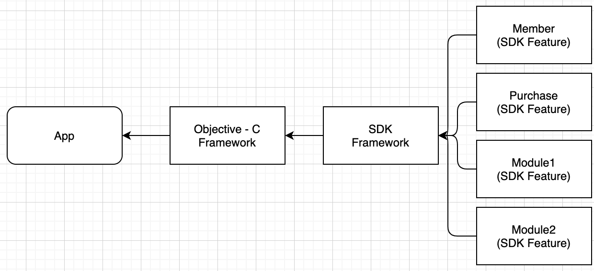


App은 나중에 만들기로 하고

우선은 Objective - C Framework 를 만드는 것을 시작으로 합니다.

새로운 프로젝트를 만들어 주는데 Framework & Library 에서 Framework를 선택해서 Objective - C로 만들어줍니다.

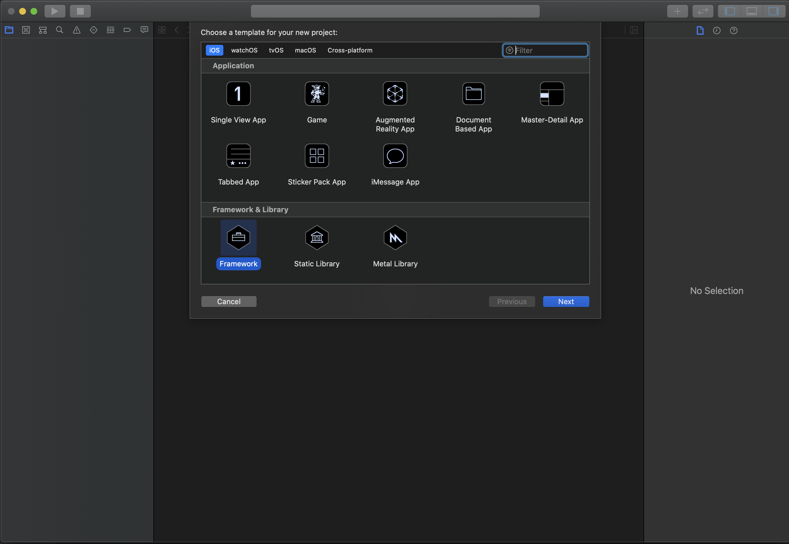


그리고 File > New > WorkSpace ... 를 선택해 새로운 Workspace를 만들어주고 현재 열려있는 Objective - C project를 닫아줍니다.

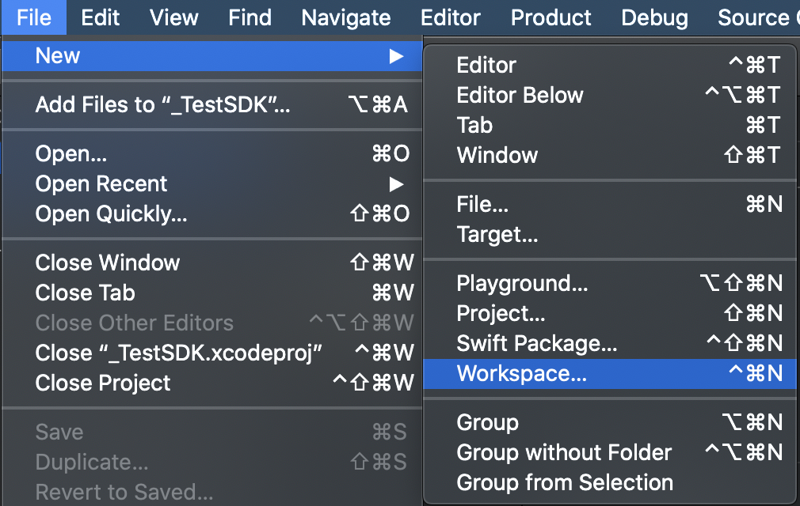

새로 만들어주는 Workspace의 위치는 최상위 폴더 바로 밑으로 정해줍니다.

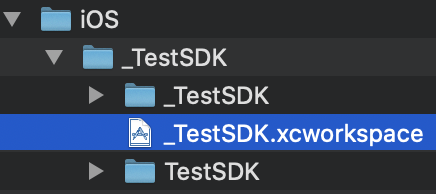


새로 만들어준 workspace를 열고 그안에 기존의 xcodeproj 파일(_TestSDK.xcodeproj)을 드래그 앤 드롭 해줍니다.

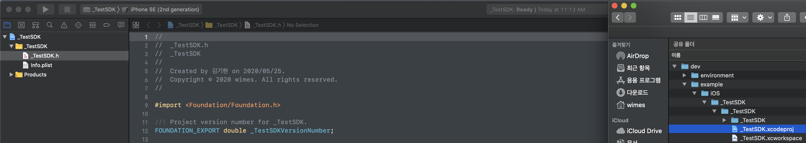


이후 새로 만들어지는 xcodeproj파일들도 workspace에 드래그 앤 드롭 해주도록 합니다.

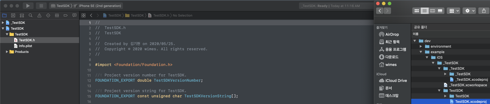


## Framework 만들어보기

우선 TestSDK 에서 Swift Code를 하나 만들어줍니다.

**TestSDK.Swift**

```swift
import Foundation

@objc public class TestSDK: NSObject{
    @objc public func login(){
        print("TestSDK.login()")
    }
}
```

여기서 중요한 부분은 `@objc` 키워드와 `public` 접근지정자 입니다.
objective - c에서 사용할 것이기 때문에 `@objc` 키워드를 붙이고 다른 framework 에서 쓸 것이기 때문에 `public` 을 붙여 줍니다.


빌드 해줍니다.

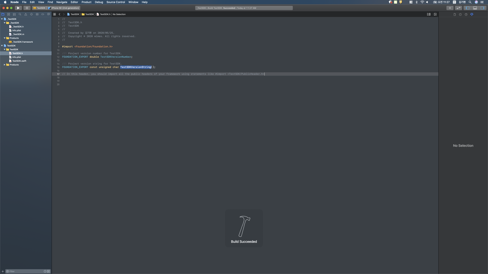


그리고 난 후에 _TestSDK > TARGETS > _TestSDK > Framework and Libraries에 TestSDK.framework를 드래그앤 드롭 해줍니다.

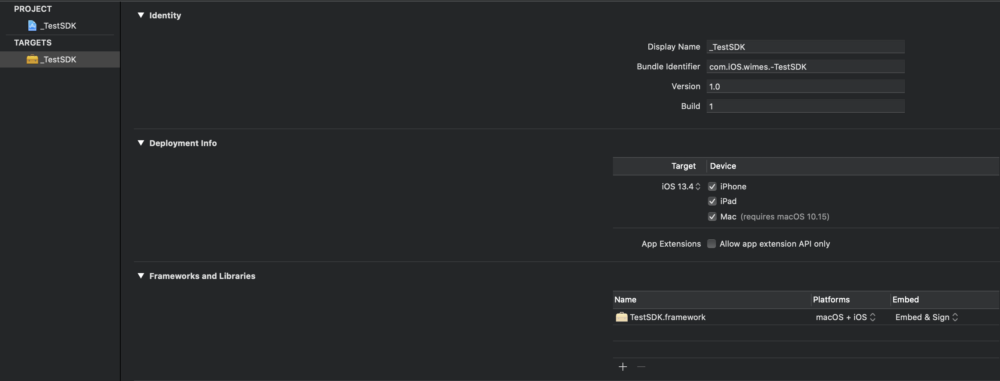


TestSDK의 Products 그룹을 보면 TestSDK.framework 를 누르면 다음과 같이 경로를 확인할 수 있습니다.

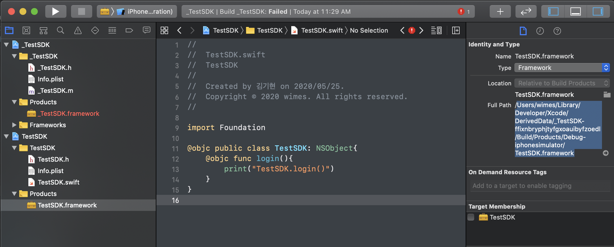

> **안해줘도 상관없습니다.**
>
> 또한 아래의 Target Membership에 체크를 해줍니다.
>
> 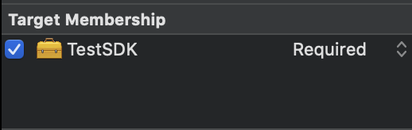


> **이부분은 블로그에서 보고 따라하느라 했던 부분 입니다. 하지 않아도 됩니다.**
>
> 해당 경로의 .framework 폴더를 통째로 복사 후 Finder에서 _TestSDK에 frameworks 폴더(frameworks 폴더는 새로 만들어줍시다.)에 넣어줍니다.
>
> 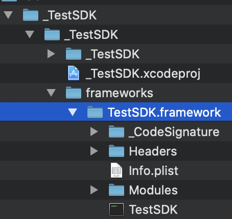


_TestSDK의 TestSDK.framework의 경로를 방금 만들었던 frameworks 폴더의 TestSDK.framework로 정해줍니다.

_TestSDK > TARGETS > Framework and Libries > + > TestSDK.framework

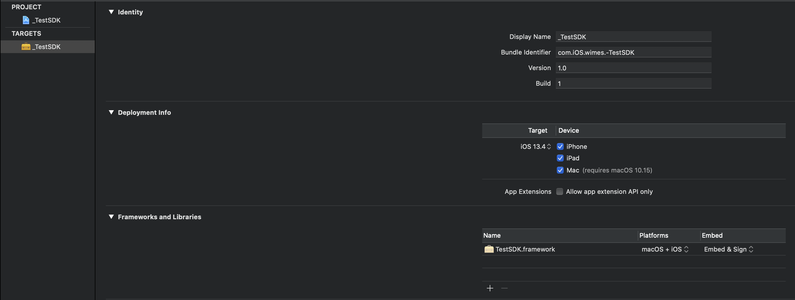

> **안해줘도 상관없습니다.**
>
> 마찬가지로 Frameworks, Product 그룹에 TestSDK.framework 의 TargetMembership에 체크를 해줍니다.
>
> 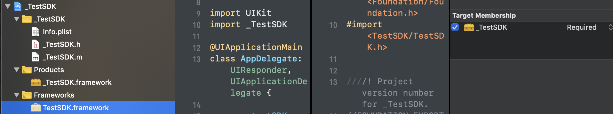
>
> 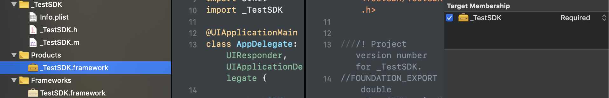


## Objective - C 에서 Swift Code 호출

그리고 _TestSDK 에서 Objective - C Code를 하나 만들어줍니다.

간단하게 TestSDK의 메서드를 호출하는 class입니다.

**_TestSDK.h**

```objective-c
#import <Foundation/Foundation.h>
#import <TestSDK/TestSDK.h>

@interface _TestSDK : NSObject
{
    TestSDK*    testSDK;
}
- (void) login;
@end
```


**_TestSDK.m**

```objective-c
#import "_TestSDK.h"

@implementation _TestSDK
- (id)init
{
    self = [super init];
    if (self) {
        testSDK = [[TestSDK alloc] init];
    }
    return self;
}

- (void) login{
    [testSDK login];
}

@end
```


## sampleApp 에서 Framework 추가 후 Test 진행

Single View App으로 Project를 만든 후  workspace에 추가해줍니다.

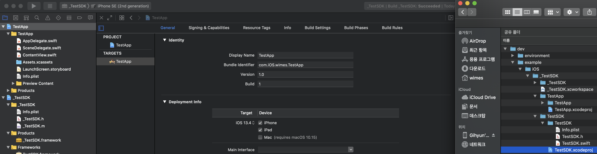


TestApp > TARGETS > TestAPpp > General > Frameworks, Libraries, and Embedded Content > + > _TestSDK.framework 를 추가해줍니다.

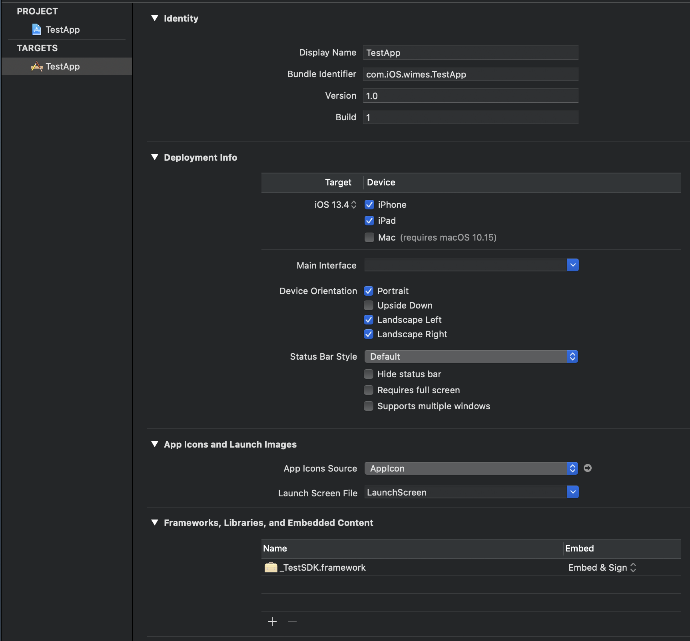


> **안해줘도 상관없습니다.**
>
> 그리고 Frameworks 그룹에서 Target Membership을 체크해줍니다.
>
> 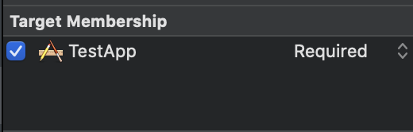


**AppDelegate.swift** 에 다음과 같이 코드를 작성 후 실행해보겠습니다.

```swift
import UIKit
import _TestSDK

@UIApplicationMain
class AppDelegate: UIResponder, UIApplicationDelegate {

    var testSDK: _TestSDK = _TestSDK()

    func application(_ application: UIApplication, didFinishLaunchingWithOptions launchOptions: [UIApplication.LaunchOptionsKey: Any]?) -> Bool {
        // Override point for customization after application launch.
        testSDK.login()
        return true
    }

    // MARK: UISceneSession Lifecycle

    func application(_ application: UIApplication, configurationForConnecting connectingSceneSession: UISceneSession, options: UIScene.ConnectionOptions) -> UISceneConfiguration {
        // Called when a new scene session is being created.
        // Use this method to select a configuration to create the new scene with.
        return UISceneConfiguration(name: "Default Configuration", sessionRole: connectingSceneSession.role)
    }

    func application(_ application: UIApplication, didDiscardSceneSessions sceneSessions: Set<UISceneSession>) {
        // Called when the user discards a scene session.
        // If any sessions were discarded while the application was not running, this will be called shortly after application:didFinishLaunchingWithOptions.
        // Use this method to release any resources that were specific to the discarded scenes, as they will not return.
    }


}
```

**결과**

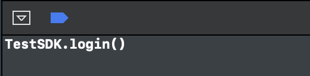


## References

**Framework 만들기**

* https://hoiogi.tistory.com/24
* [https://theemeraldtablet.tistory.com/entry/iOS-a-Library-만들고-사용해보기](https://theemeraldtablet.tistory.com/entry/iOS-a-Library-만들고-사용해보기)
* [https://labradorable.tistory.com/entry/Xcode-Static-Library-파일a-file-만들어서-Swift-프로젝트에-적용하기](https://labradorable.tistory.com/entry/Xcode-Static-Library-파일a-file-만들어서-Swift-프로젝트에-적용하기)
* https://zeddios.tistory.com/384
* [https://llldddjjj.tistory.com/entry/Swift나만의-Framework만들기?category=982659](https://llldddjjj.tistory.com/entry/Swift나만의-Framework만들기?category=982659)

**Static Library 와 framework 차이**

* https://devmjun.github.io/archive/FrameworkVsLibrary
* https://maskkwon.tistory.com/260

**Objective - C 에서 Swift Code 호출**

* https://m.blog.naver.com/PostView.nhn?blogId=m3053574&logNo=221177767643&proxyReferer=https:%2F%2Fwww.google.com%2F
* [https://medium.com/@justindna/objective-c-프로젝트에서-swift-사용-cd3e893c02a4](https://medium.com/@justindna/objective-c-프로젝트에서-swift-사용-cd3e893c02a4)


